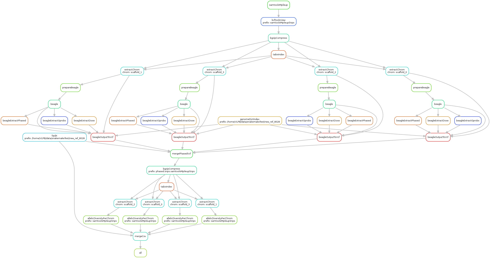

Variant calling workflows:
==========================
In the package variantCalling, all workflows are stored which execute a variant calling. Each workflow is described below.

MinimumAllelicDiversity
-----------------------
The minimumAllelicDiversity pipeline can be used to calculate the allelic diversity of different samples in fastq format. This allelic diversity contains
the steps described in the image below:
* SNP calling with samtoolsMpileup
* Conversion to vcf format
* Each chromosome is extracted, and the following rules are executed per chromosome:
	* Convert the vcf file to a beagle input file
	* BEAGLE for phasing the SNPs
	* Convert the beagle output to phased vcf format
* Merge the phased vcf files
* Each chromosome is extracted, and the following rules are executed per chromosome:
	* Calculate allelic diversity
* All csv files are merged by concatenating them

The configuration has to contain the following elements:

	{
    	"mapping":{
			"referenceGenome":"/path/to/index.fasta"
		},
	
	    "options":{
			"java":{
				"memUsage":"-Xmx3g"
			},
			"beagle":{
				"path":"/path/to/beagle"
			},
			"gatk":{
				"path":"/path/to/gatk"
			},
			"picardTools":{
				"path":"/path/to/picardTools"
			},
			"vcfUtils":{
				"path":"/path/to/vcfUtils",
				"optionalOpts": ""
			},
			"mpileup":{
				"input" : [
						"/path/to/input_1.fastq",
						"/path/to/input_2.fastq"
					]
			}
    	}
	}

SimpleVariantCalling
--------------------
The simple variant calling is creates a multi sampled vcf file from different samples in fastq format. Each step is described below:
* SNP calling with samtoolsMpileup
* Conversion to vcf format

The configuration has to contain the following elements: 

	{
    	"mapping":{
			"referenceGenome":"/path/to/index.fasta"
		},
	    "options":{
			"mpileup":{
				"input" : [
						"/path/to/input_1.fastq",
						"/path/to/input_2.fastq"
					]
			}
    	}
	}